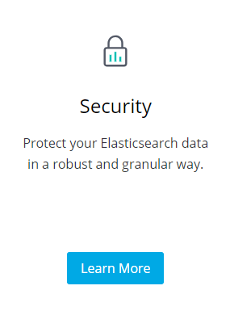

# Elastic Search
##### A Fulltext Search Solution

---

## Descriptions

+++
#### What is Elastic Search?

Elasticsearch is a search engine based on <strong>Lucene</strong>. It provides a distributed, multitenant-capable full-text search engine with an HTTP web interface and <strong>schema-free JSON</strong> documents. 

So what is <strong>Lucene</strong>?

+++
#### Not a complex detailed explanation

Apache Lucene is a free and open-source information retrieval software library. (Initial release 1999)

+++
#### But a good simple and flexible architecture

At the core of Lucene's logical architecture is the idea of a <strong>document</strong> containing <strong>fields</strong> of text. This flexibility allows Lucene's API to be independent of the file format. Text from PDFs, HTML, Microsoft Word, Mind Maps, and OpenDocument documents, as well as many others (except images), can all be indexed as long as their textual information can be extracted.

+++
#### Elastic Search Technological Details
Elasticsearch is developed in <strong>Java</strong> and is released as open source under the terms of the Apache License. Official clients are available in Java, .NET (C#), PHP, Python, Groovy and many other languages. 

---

## History

+++

#### First release (0.4	2010-02-08) 

<strong>Shay Banon</strong> created the precursor to Elasticsearch, called Compass, in 2004. While thinking about the third version of Compass he realized that it would be necessary to rewrite big parts of Compass to <strong>"create a scalable search solution"</strong>. So he created <strong>"a solution built from the ground up to be distributed"</strong> and used a common interface, <strong>JSON over HTTP</strong>, <strong>suitable for programming languages other than Java</strong> as well. Shay Banon released the first version of Elasticsearch in <strong>February 2010</strong>.

+++

#### Latest release (6.5.3 2018-12-11) 

* Simple scalable searh solution to modularized and extensible product compatible to companies

## Market and Users

+++

#### Popularity
Elasticsearch is the most popular enterprise search engine followed by Apache Solr, also based on Lucene.

+++
#### Users
* CERN
* Netflix
* Github
* Facebook
* Goldman Sachs (https://www.informationweek.com/software/enterprise-applications/goldman-sachs-puts-elasticsearch-to-work/d/d-id/1321778)

---
## Integrated solution pieces (ELK Stack)

+++

#### Elastic Search
The heart of the Elastic Stack

+++

#### Log Stash
A data-collection and log-parsing engine

Logstash is an open source, server-side data processing pipeline that ingests data from a multitude of sources simultaneously, transforms it, and then sends it to your favorite “stash.” (Ours is Elasticsearch, naturally.)

+++
#### Kibana
An analytics and visualisation platform 

## Stack Features

---
## Workshop
